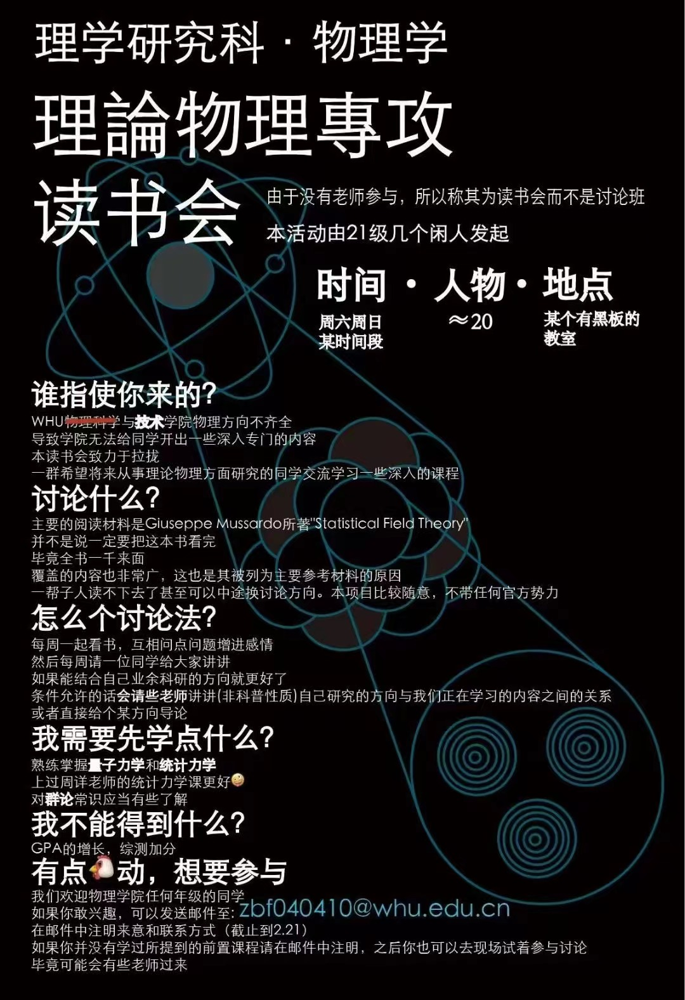

# 统计场论讨论班讲义
## 本次讨论班举办于2024年3-6月  
  
参考教材：Statistical Field Theory - An Introduction to Exactly Solved Models in Statistical Physics (Giuseppe Mussardo)  
主要内容：介绍了二维伊辛模型的对偶性。先讲解了二维模型中的高温与低温展开，之后讲解了方形晶格中的对偶和三角晶格与六角晶格的对偶。并且引入了重要的star-triangle identity。最后简要讲解了利用代数化的方法实现对偶。
